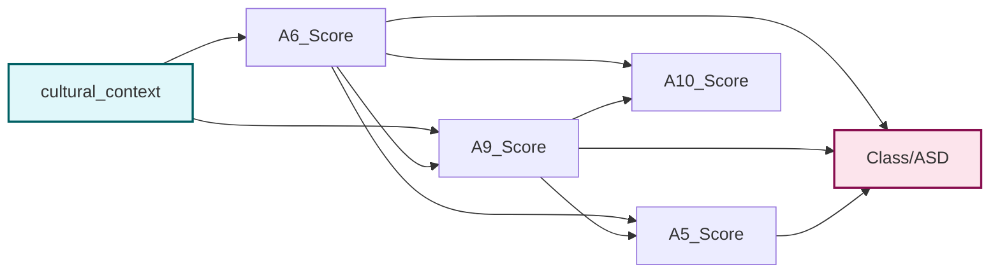

<!-- _class: invert -->

# Impacto do Contexto Cultural na Triagem do TEA

## Uma Abordagem com Aprendizado de Máquina

&nbsp;

Éverton da Cunha Sousa · Ana Livia dos Santos Freitas
Ilton Cavalcante de Lima Neto · Edmundo Anderthon da Silva Barbosa

Campus de Russas — Universidade Federal do Ceará

---

# Motivação

- Diagnóstico tardio do TEA impacta vida psicológica, social e profissional
- Instrumentos de triagem (AQ-10) são validados em populações ocidentais
- Adultos desenvolvem **camuflagem social**, mascarando sintomas

&nbsp;

**Pergunta de pesquisa**

O contexto cultural influencia as respostas ao AQ-10 nas subescalas de comunicação e habilidades sociais?

---

# Contexto Cultural — Hall (1976)

**Alto Contexto**
Comunicação implícita, dependente de nuances relacionais
→ América do Sul, África, Ásia, Oriente Médio

&nbsp;

**Baixo Contexto**
Comunicação explícita e direta
→ EUA, Canadá, Europa Ocidental

&nbsp;

**Hipótese:** em culturas de alto contexto, indivíduos _sem_ TEA podem pontuar de forma semelhante a indivíduos _com_ TEA nos itens de comunicação e habilidades sociais.

---

# Atributos Selecionados do AQ-10

| Subescala           | Atributo    | Enunciado                                     |
| ------------------- | ----------- | --------------------------------------------- |
| Comunicação         | `A5_Score`  | "Ler nas entrelinhas" em conversas            |
| Comunicação         | `A6_Score`  | Perceber quando o interlocutor está entediado |
| Habilidades Sociais | `A9_Score`  | Inferir emoções pelo rosto                    |
| Habilidades Sociais | `A10_Score` | Compreender intenções alheias                 |

&nbsp;

Features finais: `A5` `A6` `A9` `A10` `gender` `austim` `cultural_context`

---

# Base de Dados

Dataset: _ASD Screening Data for Adult_ — Thabtah (2017) · 704 instâncias

| Conjunto     | Instâncias | Não TEA | TEA |
| ------------ | ---------- | ------- | --- |
| Treino (80%) | 563        | 412     | 151 |
| Teste (20%)  | 141        | 103     | 38  |

&nbsp;

**Modelagem:** Random Forest (100 árvores, Gini, seed 42) e Rede Bayesiana (Hill Climbing, BIC, 500 iter.) com validação cruzada estratificada k=5.

---

# Resultados — Comparativo Geral

| Modelo         | Accuracy | Precision | Recall | F1-Score  |
| -------------- | -------- | --------- | ------ | --------- |
| Random Forest  | 0.858    | 0.737     | 0.737  | **0.737** |
| Rede Bayesiana | 0.844    | 0.722     | 0.684  | **0.703** |

&nbsp;

- **RF** → maior Recall e F1: preferível para rastreamento (minimiza falsos negativos)
- **BN** → maior Precision: útil para refinar encaminhamentos
- Papéis complementares em um fluxo de triagem em etapas

---

# Resultados — Desempenho por Classe (RF)

| Classe    | Precision | Recall   | F1-Score | Suporte |
| --------- | --------- | -------- | -------- | ------- |
| Não TEA   | 0.90      | 0.90     | 0.90     | 103     |
| TEA       | 0.74      | 0.74     | 0.74     | 38      |
| **Geral** | **0.86**  | **0.86** | **0.86** | **141** |

---

# Importância dos Atributos (RF)

| Atributo                | Importância |
| ----------------------- | ----------- |
| A9 — Habilidade Social  | 0.302       |
| A5 — Comunicação        | 0.236       |
| A6 — Comunicação        | 0.217       |
| A10 — Habilidade Social | 0.110       |
| Contexto Cultural       | 0.068       |
| Histórico Familiar      | 0.034       |
| Gênero                  | 0.033       |

A9 e A5 concentram mais de 53% da relevância preditiva do modelo.

---

# Estrutura da Rede Bayesiana

Arestas aprendidas (Hill Climbing · BIC):

&nbsp;

Distribuição marginal a priori:

- Não TEA: **73.2%** · TEA: **26.8%**

&nbsp;

---

# Resultado Central — Análise por Contexto Cultural

| Contexto  | n   | Accuracy | Precision | Recall | F1-Score  |
| --------- | --- | -------- | --------- | ------ | --------- |
| **Baixo** | 60  | 0.867    | 0.875     | 0.808  | **0.840** |
| **Alto**  | 81  | 0.852    | 0.500     | 0.583  | **0.538** |

&nbsp;

Queda de **0.840 → 0.538** no F1-Score entre baixo e alto contexto.

O "ruído cultural" se aproxima do "sinal clínico", reduzindo a separabilidade entre classes.

---

# Médias dos Scores AQ-10 por Grupo

| Contexto  | Diagnóstico | A5   | A6   | A9   | A10  |
| --------- | ----------- | ---- | ---- | ---- | ---- |
| Alto (0)  | Não TEA     | 0.35 | 0.12 | 0.14 | 0.44 |
| Alto (0)  | TEA         | 0.95 | 0.63 | 0.77 | 0.91 |
| Baixo (1) | Não TEA     | 0.32 | 0.12 | 0.15 | 0.48 |
| Baixo (1) | TEA         | 0.94 | 0.75 | 0.83 | 0.88 |

&nbsp;

Padrões de resposta similares entre contextos — a diferença de desempenho reflete a distribuição das classes, não dos scores em si.

---

# Discussão

**Viés transcultural no AQ-10**
O instrumento assume comunicação de baixo contexto como "linha de base". Comportamentos avaliados como déficit em culturas diretas podem ser variação típica em culturas implícitas.

&nbsp;

**Camuflagem social**
Brasil é alto contexto: exatamente o grupo com pior desempenho. A transição representa oportunidade para calibração transcultural nos instrumentos nacionais. A sobreposição de traço cultural e manifestação clínica amplifica o risco de sub-identificação em ambientes acadêmicos e de saúde pública.

---

# Limitações e Trabalhos Futuros

**Limitações**

- Representatividade geográfica desigual entre grupos
- Classificação binária ignora gradientes e identidades híbridas
- Ausência de `age`, escolaridade, nível socioeconômico
- Sem validação externa em coortes independentes

&nbsp;

**Trabalhos futuros**

- Modelos hierárquicos com localidade como efeito aleatório
- Escalas contínuas (dimensões de Hofstede)
- Investigar equidade algorítmica entre subgrupos
- Ampliar para outras subescalas do AQ-10 e M-CHAT

---

<!-- _class: invert -->

# Conclusão

O contexto cultural influencia de forma **mensurável** o desempenho de modelos de triagem do TEA baseados no AQ-10.

&nbsp;

- F1-Score cai de **0.840 (baixo contexto)** para **0.538 (alto contexto)**
- RF e BN atuam de forma complementar: rastreamento amplo + refinamento
- Instrumentos calibrados em populações de baixo contexto tendem a **sub-identificar** casos em países como o Brasil
- Incorporar informações socioculturais em modelos de ML favorece ferramentas mais **equitativas e culturalmente sensíveis**

---

<!-- _class: invert -->

# Obrigado

